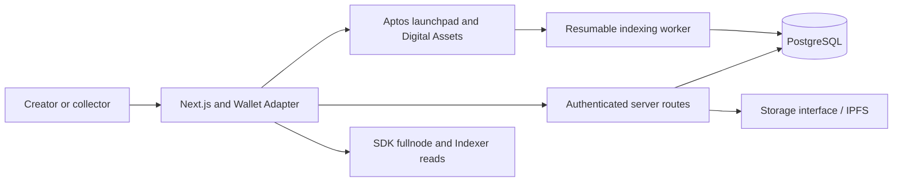

# Mintos — Phase 1 architecture

Status: Phase 1A / Gate A passed on real testnet; not audited or mainnet-ready.
Research date: 2026-09-23. Scope: creator self-service NFT launchpad on Aptos.
Tagline: The NFT home of Aptos. Product copy comes from `packages/config`.

Implemented: shared configuration/domain/storage interface, database schema,
fee policy, native Digital Asset launchpad and operator acceptance tooling.
The application, indexing, storage adapter and authentication sections below remain
the intended design, not implemented services. See [TESTNET_ACCEPTANCE.md](TESTNET_ACCEPTANCE.md).

## 1. Application architecture

Use an npm-workspace TypeScript monorepo, Next.js App Router with React,
Tailwind and accessible lightweight components, and TanStack Query for live
chain state. Use PostgreSQL with Drizzle for product records and event projections.
A separate resumable Node worker indexes chain transactions; do not depend on
long-running Vercel request handlers. Next.js server routes handle sessions,
drafts, storage tickets, reports and moderation. Shared domain code contains
metadata validation, integer money conversion and drop-state rules.

The browser signs through the official wallet adapter. The server never holds
creator, buyer or platform signing keys. Frontend deployment works on Vercel;
the indexer runs on standard Node infrastructure against managed PostgreSQL.
Use Node 22+ (SDK requirement); development currently has Node 24.



No marketplace contracts, token, auctions, staking, DAO or cross-chain abstraction
in Phase 1. Normal transferable Digital Assets and stable address identities allow
a separate fixed-price marketplace later without migrating NFTs.

## 2. Aptos standards and pinned dependencies

- NFT standard: `0x4::collection`, `0x4::token`, `0x4::royalty` from
  AptosTokenObjects. Digital Asset replaces Token V1. Use custom launchpad entry
  functions around the native primitives; the generic `aptos_token` mint API alone
  does not enforce launchpad prices, deadlines or per-wallet limits.
- Objects: a dedicated non-transferable authority object per drop, with its
  `ExtendRef` retained only inside a private launchpad resource. Never return a
  signer or capability from a public function. Record the human creator wallet
  separately: indexers may identify the authority object as the native creator.
- Collection creation: `collection::create_fixed_collection`. Mint with
  `token::create_named_token` using the authority signer; register unique token
  names in sequential manifest order. Transfer the created token to the minter in the
  same transaction using its constructor reference.
- Royalties: `royalty::create(bps, 10000, creator)` attached at collection creation.
  Discard royalty mutation capabilities. Tokens inherit collection royalties.
  The standard records royalties; arbitrary future transfers do not automatically
  pay them. A future marketplace must read and honor the native royalty policy.
- Properties: preserve validated attributes in immutable IPFS JSON initially.
  Reserve native `property_map` for fields that must be queried on-chain; use
  its typed BCS inputs if introduced. No untyped arbitrary property setter.
- Events: `#[event]` structs and `aptos_framework::event::emit`; no new EventHandles.
- APT payments: use pinned framework `aptos_account::transfer`, whose current
  implementation handles primary fungible stores, rather than assuming every
  wallet has a legacy CoinStore. Exact payment deltas passed Gate A on testnet.
- TypeScript: `@aptos-labs/ts-sdk` 7.3.0, current npm stable observed on research date.
- Wallet: `@aptos-labs/wallet-adapter-react` 8.3.3; AIP-62 discovery, Petra and
  Aptos Connect. No legacy per-wallet plugin list. Disable adapter telemetry.
- Reads: SDK fullnode/view APIs for mint eligibility and committed transaction
  results; SDK Indexer/GraphQL for token discovery. Indexer lag cannot turn a
  committed success into failure. Owner checks require fresh chain evidence.
- Framework research pin: aptos-core
  `1b116b414ccc1d860fa72160d9b9a770e8d8e88f` (observed `testnet` branch head).
  This is a reproducibility pin. Gate A verified the APIs used by this package
  through real publication, collection creation and mint settlement; it does not
  establish support for every API in that revision or mainnet compatibility.
- CLI: official release 9.6.0 selected for local compilation and unit tests.

### Framework/documentation discrepancy

The Digital Asset overview says maximum supply cannot change after creation.
The pinned `collection.move` includes `set_max_supply(&MutatorRef, u64)`.
Therefore the launchpad must not generate/store a collection MutatorRef, must
discard unused constructor capabilities, and must enforce its own immutable
lifetime cap. Audit code and deployed bytecode, not only prose documentation.
Do not use the owner-mint API variant, which introduces additional transfer and
mint-authority semantics and feature dependencies unnecessary for this MVP.

## 3. Contract architecture and authority

`fee_policy.move`: private configuration resource under the package address,
initial 500 bps (5%), hard maximum 1000 bps, nonzero recipient, two-step admin transfer,
admin-only updates and pause, and module events. Pure checked quote arithmetic
uses u128 intermediates and returns u64 values. No custody or withdrawal facility.

`launchpad.move` (implemented): Drop holds creator, authority ExtendRef,
collection address/name, immutable terms, staged token metadata, lifetime minted
count and wallet mint counters. A creator can prepare a draft and append bounded
chunks, then finalize. No public mint before finalization. No platform-owned
free mint or reserved mint bypass. Price zero is supported by the same accounting
path without adding a separate mint stage.

Implemented entry points:

- `prepare_drop`: authenticate creator, validate supply/price/limits/timestamps,
  create internal authority and draft. Snapshot fee bps into the draft; review
  and finalize must agree on these terms. Fee changes affect future drops only.
- `append_metadata`: creator only, sequential offset, bounded chunk; store
  immutable IPFS metadata URI and unique token name at a sequential ID. No
  overwrites or duplicate names/URIs. Supply must match exactly. The on-chain
  URI check enforces a bounded ASCII IPFS shape, not CID validity or availability;
  full CID/manifest validation is performed by the TypeScript domain layer.
- `finalize_drop`: creator only, require complete metadata and valid schedule,
  create the native collection and freeze terms. Emit `CollectionCreated`.
  Store the current fee recipient only as audit data if desired; mints use the
  current configured treasury so a lost treasury can be rotated securely.
- `mint(drop, quantity, expected_unit_price, max_total)`: validate finalized state,
  global/collection pause, start <= chain time, end absent or time < end, positive
  bounded quantity, remaining lifetime supply and lifetime per-wallet count.
  Assert expected price and slippage ceiling. Compute total and split atomically,
  transfer APT to creator and treasury, create tokens, transfer ownership and
  emit an NFTMinted event for each token with exactly allocated fee/revenue values.
  Any failure rolls back payments, counters and NFTs together (gas can still cost).
- `set_creator_paused` / `set_admin_paused`: separate flags; neither party
  can clear the other party's flag. This affects minting only, never NFT transfers.
- View functions expose configuration, terms, eligibility counters and mint state.

Fee rounding: floor(price_octas * bps / 10000) per NFT, multiplied by quantity.
This makes fees independent of transaction batching. Creator receives the exact
remainder. All monetary values are integers; reject values exceeding u64. No
JavaScript floating-point calculations for money or chain counters.

Keep NFT transfer permissions with owners. Do not retain token ExtendRef,
TransferRef, BurnRef or MutatorRef. Lock authority object transfer at construction;
discard its TransferRef. Lock native collection transfer defensively as well.
No admin changes to price, supply, creator payout, metadata, schedule or royalties
after finalization. Pauses are disclosed. Per-wallet limits are not Sybil protection.

Mainnet launchpad package should be immutable after external review; otherwise an
upgrade authority can undermine all capability restrictions. Use versioned packages
for later releases. Testnet may use compatible upgrades, explicitly disclosed.
Operational fee/pause admin should be an Aptos multisig account before mainnet;
the Move API accepts its authenticated signer. An address allowlist in a website
is not contract authorization.

Events: DropPrepared, MetadataAppended, CollectionCreated, NFTMinted (drop,
collection, token, creator, buyer, treasury, serial, unit price, fee, creator revenue,
timestamp), PlatformFeeUpdated, FeeRecipientUpdated,
AdminTransferProposed/Accepted, PlatformPauseUpdated, CollectionPauseUpdated.
No timer-triggered events: live/ended are derived from chain time and terms.

## 4. Data model

SQL schema is defined with Drizzle in `packages/database/src/schema.ts`.
All chain identities include network; addresses are canonical 32-byte hex.
Use numeric(20,0) mapped to strings for u64 values (signed PostgreSQL bigint is
not sufficient). Transaction event identities include network/version/event index.

- User: wallet address, creation timestamp. CreatorProfile: user, display name,
  biography and image URI. Wallet control and editorial verification are distinct.
- CollectionDraft: owner, JSON configuration, validation status, manifest URI and
  upload progress; never authoritative chain state.
- Collection: network/address, authority, creator wallet, slug, metadata URI,
  name/description, logo/banner, transaction hash, verification/visibility flags.
- Drop: one immutable Phase 1 drop per collection, price/supply/limits/schedule,
  royalty and snapshotted primary fee, projected minted count and indexed version.
- Mint: one row per NFTMinted event, token address/serial, minter, amounts and tx.
  Ownership is deliberately absent; mint recipient is historical, not current owner.
- SocialLink: collection/type/validated URL. CollectionReport: reason/text/status.
- ModerationAction: actor, action, reason and audit timestamp.
- PlatformConfig: off-chain homepage/runtime settings and mirrored on-chain state
  with indexed version, never an alternative authority for fees or pauses.
- IndexerCheckpoint: network/processor/next transaction version for resumable jobs.
- AuthChallenge/Session: domain-bound nonce, expiration, one-time consumption,
  hashed session token and server-side roles. Connecting a wallet is not login.

Indexing verifies chain ID, configured module address, transaction success and
event type before accepting any client-submitted transaction hash. Checkpoint and
event writes commit together; unique constraints make replay safe. Poll a bounded
transaction range from the deployment version for initial volume, with retry and
lag monitoring; never use deprecated event-handle endpoints for module events.
Upgrade to a transaction-stream consumer only if measured volume requires it.
An interrupted poll must resume without missed events or double-counted revenue.

## 5. Storage, authentication and UX

StorageProvider provides immutable directory/file upload, content-addressed URI,
availability check and pin status. First implementation targets IPFS-compatible
HTTP services; the provider credential stays server-side. Store `ipfs://` URIs,
derive browser gateway URLs separately. An IPFS CID does not guarantee persistence:
require retention/pinning and a second retrieval check before finalization.

Start with a versioned JSON manifest and individual asset uploads. A ZIP parser
is optional later, avoiding archive path traversal and decompression attacks.
Manifest IDs are contiguous 1..supply with one metadata entry per ID. Reject
duplicates, gaps, missing images, malformed attributes, inconsistent counts and
oversized files. Perform byte and MIME checks; restrict public images to safe raster
formats initially. Never fetch arbitrary user URLs from a privileged server.
Use bounded IPFS gateway retrieval with redirect, timeout and private-network checks.
On-chain validation cannot prove an image is safe; distinguish metadata structural
checks from content moderation and storage availability.

Wallet login uses the current official SIWA verification path, supporting standard
wallet account schemes rather than hand-written Ed25519-only verification. Bind
nonce, domain, URI, chain and expiry; consume challenges atomically. Sessions use
HttpOnly/Secure/SameSite cookies; mutation routes require origin/CSRF protection,
authorization and rate limits. Admin routes require authenticated server-side roles;
contract changes still require the actual admin signer in its wallet.

Mobile-first mint state machine: disconnected → ready → wallet confirmation →
submitted → committed success or committed failure. A timeout is unknown/pending;
retain the hash and reconcile before offering a retry. Check selected chain ID
before each signature. Distinguish declined wallet requests, insufficient APT
(price plus gas), wrong network, sold out and paused from retryable network faults.
Never show raw VM strings to normal users. A successful wallet submission alone
is not mint success: verify committed transaction and NFTMinted events.

Homepage/explore present only real indexed drops, with useful empty/error states.
Collection state precedence: SOLD OUT, ENDED, UPCOMING, LIVE; pause is an additional
visible restriction. Show UTC-derived local time with timezone labels. Creator flow
has all eight requested steps and estimates actual transaction count after metadata
chunking. The wallet signs only reviewed payloads. No user-facing CLI requirement.

Dashboard derives primary sales from canonical events, not ownership projections.
Moderation hiding removes discovery visibility but cannot remove assets or stop
direct on-chain activity. Verification means reviewed identity/provenance, never
a guarantee of value or safety. Collection OG metadata includes name, artwork,
price and status; cache with bounded freshness. X sharing is a plain share URL.

Analytics: aggregate page views/short-lived first-party sessions without persistent
fingerprinting; wallet connects and mint attempts are separate from authenticated
users and confirmed events. Chain events provide collections launched, unique
minters, gross volume and fees. Define launched as finalized and start reached;
report collections with at least one mint separately. Do not send full wallet
addresses or storage credentials to third-party analytics. Honor privacy settings.

## 6. Repository

```text
apps/web/                 Next.js UI and server routes (after contracts)
apps/indexer/             Resumable Node chain projection worker (later)
packages/config/          Replaceable branding and validated environment
packages/domain/          Money, metadata and state rules
packages/aptos/           SDK client, payloads, chain reads (after ABI is tested)
packages/database/        Drizzle schema and SQL migrations
packages/storage/         IPFS-compatible interface and adapters
move/launchpad/           Pinned Move package, sources and tests
scripts/                  Local tooling and validation
docs/                     Research, contract tests and deployment evidence
```

Do not create empty UI packages or generic abstractions before they are needed.

## 7. Milestones and acceptance gates

1. Phase 1A / Gate A — launchpad core: complete. 82 Move tests, 13 TypeScript
   tests, real testnet collection, independent buyer ownership, 5% settlement,
   native royalties, counters and events verified. This is operator/SDK acceptance.
2. Phase 1B / Gate B — existing Aptos NFT discovery and Token V1/V2 compatibility:
   pending. Research real historical collections, document transfer/royalty
   restrictions and build verified wallet ownership queries. No compatibility
   matrix or legacy implementation is claimed by Gate A.
3. Phase 1C / Gate C — minimal launchpad UI: wallet integration, homepage/explore,
   creator wizard, persistent IPFS uploads, collection/mint flow, database/indexer,
   dashboard and authenticated moderation. Verify desktop/mobile browser flows,
   rejected signatures, network changes, pending recovery and production build.
4. Phase 2 / Gate D — fixed-price secondary trading after preceding gates;
   Token V1 and V2 settlement require their own verified compatibility decisions.
   The planned 200 bps secondary fee remains separate from primary fees; no
   marketplace contract is implemented.
5. Phase 3 / Gate E — unified creator and collector product.
6. Phase 4 — growth and advanced features only when explicitly scoped.

Phase 2 is blocked until every Phase 1 definition-of-done item is verified.
Mainnet additionally requires the independent review, multisig, immutable package
and operational gates in [MAINNET_CHECKLIST.md](MAINNET_CHECKLIST.md).

## 8. Open assumptions / validation required

- Framework pin/API support: Gate A compiled and published the pinned package,
  matched deployed module bytecode, and exercised native collection/mint/payment
  APIs on chain ID 2. Mainnet compatibility remains unverified.
- Metadata chunk size, maximum supply and quantity: benchmark real gas/storage
  and transaction payloads. Contract caps are 10,000 supply, 25 metadata entries
  per upload and 20 NFTs per mint. Gate A exercised 100 entries and two NFTs;
  a 25-entry upload exceeded a 200,000 gas budget and succeeded with 500,000.
  Full-cap benchmarks remain open; no arbitrary-size deployment promise.
- SDK 7.3.0 and adapter 8.3.3: validate resolved dependency compatibility, Petra
  desktop/mobile, Aptos Connect redirects and wallet network reporting.
- Native creator is the authority object: validate wallet/indexer presentation and
  include verifiable human-creator attribution in resource, events and metadata.
- Indexer coverage/retention/rate limits: verify module-event query availability;
  fullnode transaction ingestion is the baseline, with pruned-history recovery.
- SIWA: verify supported signature/account schemes and replay/chain handling with
  the installed official verifier before exposing authenticated mutations.
- IPFS persistence/provider credentials, database hosting and treasury/multisig
  addresses remain deployment inputs; no fake values or private keys in source.
- Mainnet framework compatibility may differ; repeat all chain acceptance gates
  against the intended version before any mainnet publish.

## Official sources

- [Digital Asset standard](https://aptos.dev/build/smart-contracts/digital-asset)
- [Objects](https://aptos.dev/build/smart-contracts/objects)
- [TypeScript SDK](https://aptos.dev/build/sdks/ts-sdk)
- [Wallet Adapter](https://aptos.dev/build/sdks/wallet-adapter/dapp)
- [Indexer access](https://aptos.dev/build/indexer/indexer-api)
- [Module events](https://aptos.dev/network/blockchain/events)
- [SIWA](https://siwa.aptos.dev/docs/ts-aptos-labs-wallet-adapter-react/quick-start)
- [Pinned collection framework](https://github.com/aptos-labs/aptos-core/blob/1b116b414ccc1d860fa72160d9b9a770e8d8e88f/aptos-move/framework/aptos-token-objects/sources/collection.move)
- [Pinned token framework](https://github.com/aptos-labs/aptos-core/blob/1b116b414ccc1d860fa72160d9b9a770e8d8e88f/aptos-move/framework/aptos-token-objects/sources/token.move)
- [Pinned APT transfer framework](https://github.com/aptos-labs/aptos-core/blob/1b116b414ccc1d860fa72160d9b9a770e8d8e88f/aptos-move/framework/aptos-framework/sources/aptos_account.move)
- [Pinned royalty framework](https://github.com/aptos-labs/aptos-core/blob/1b116b414ccc1d860fa72160d9b9a770e8d8e88f/aptos-move/framework/aptos-token-objects/sources/royalty.move)
- [Pinned property framework](https://github.com/aptos-labs/aptos-core/blob/1b116b414ccc1d860fa72160d9b9a770e8d8e88f/aptos-move/framework/aptos-token-objects/sources/property_map.move)

Package versions were checked using `npm view`; CLI release assets were checked
through the official aptos-labs/aptos-core GitHub release API. No tutorial package
versions were copied into the dependency plan.
